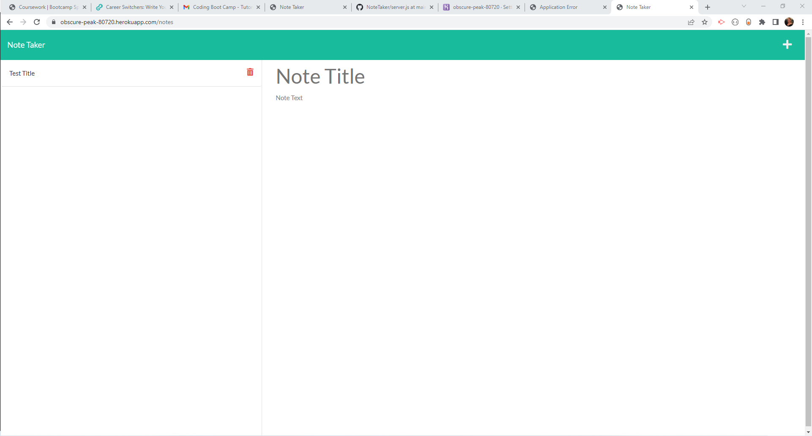

# NoteTaker

## Table of Contents

- [description](#description)
- [aunch]](#launch)
- [collaborators](#collaborators)
- [license](#license)
- [badges](#badges)
- [features](#features)
- [contribute](#contribute)
- [tests](#tests)
- [questions](#questions)

## Description

Using starter code, develop back end for an application called Note Taker that can be used to write and save notes. This application uses an Express.js back end and saves and retrieves note data from a JSON file.

## Launch

https://obscure-peak-80720.herokuapp.com/notes

## Collaborators

## License

## Badges

yes

## Features

Writes, Saves and Deletes notes.

## Contribute

Starter code provided by coding boot camp

## Tests

## Questions

Please reach out with any questions!

- Github: mrsamylighfoot
- Email: MrsAmyLightfoot@gmail.com
